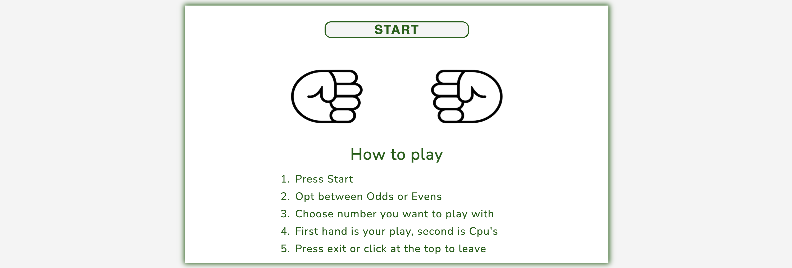
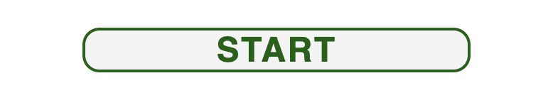
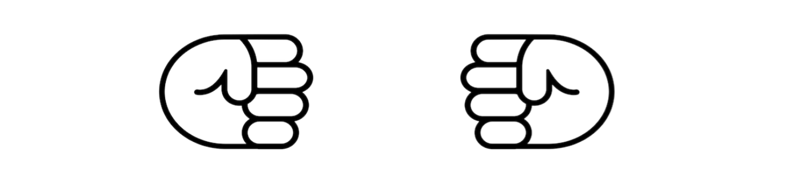
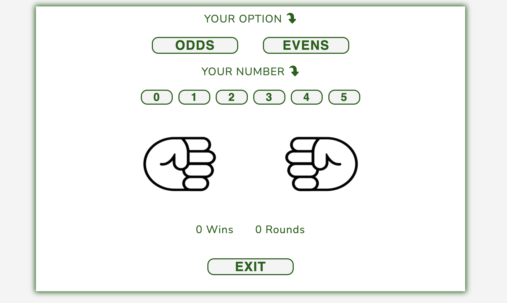
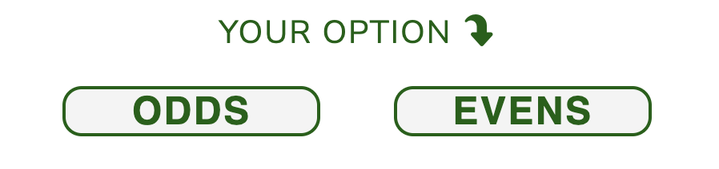
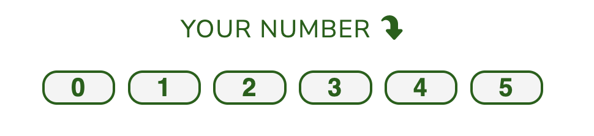

# Odds and Evens

Odds and Evens is a game developed with two main objectives: provide a quick gaming session to its users when they are in the middle of a quick break, either from working time or studying session - targeting adults and children. 

The game proves itself as good tool for a quick stress relief allowing users to play against the Cpu. Users opt between odds and evens, then pick up a number between 0 to 5, representing their own hands for their game-play. From there, the Cpu generate a completely random number within the same range. The game result is based on the sum of both numbers, which are always either an odd or even number. Based on number type, if it matches user's opted number, user wins otherwise Cpu wins.

While playing, the users will also learn how to play the game, which can be used as a decision making tool, especially amongst friends, to determine who get the last cookie, for example. Users can either use the game itself or learn their own hands to play.


## Features

### Existing Features

### - Header

- Located at the top of the page, the header features the game name **Odds and Evens** followed by an simple icon representing playing with hands by showing the victory signal. The game name is presented in a easy readable font and using colour with high contrast with footer background colour.
- Clicking on the game name leads users back to the initial page also exiting the game.


### - Instructions Container

- Featured centralized in the page, this is the initial screen users see. It contains the **start** button, the **initial image** and the **how to play** section. This section is hidden when the game starts, being replaced by the *Game Container* we will see further below.



- **Start** button: this is the first element seen inside the container, being placed even before instructions. This positioning is intentional, as odds and evens game is a well-known game world-while, the game uses a minimalist UI to allow user to start playing straight away. The button changes its colour when hovering over it, featuring a slight transition and when clicked, takes users to the game itself.

  

- **Initial image**: featured in the middle, this section contains an image displaying two closed hands 'facing' each other, the typical position users do before playing an odds and evens game. This design aims make users either recognise the game or to start learning how to play it. 

  

- **How to play**: section: the third element, contains straight forward instructions about how to start the game and following up actions users should take. These instructions are focused only on the actions users need in order to play, not specific rules, as these will be displayed inside other elements. This design is made to push users to interact with the game,  teaching them along the way.

  

### - Game Container

  - The game container is hidden when the game starts and it is displayed when users start the game by pressing/clicking *start* on the previous screen. This is where the game takes places and it features odds and evens **option buttons**, **number buttons** from 0 to 6, the **game image**, the **results** section and the **exit** button. 
	


 - **Option buttons**: these are the buttons where users opt if they want either odds or evens for their game-play. As the option is required to play, the *number buttons* will be available only after users pick their option. The buttons feature the same animation detailed above for the *start* button, however, the option buttons are also highlighted when clicking, in order to show users which option they picked and the selected button will maintain this status until users pick different option. This allows multiple rounds to be played without the need to click on the option every single time - if users wish to continue playing with the same option. 
	
  

 - **Number Buttons**: the are the buttons where users pick the number they want to use with their hand in the game-play, from 0 (closed hand) to 5 (open hand, with 5 fingers) and which will represent half of the final sum. As previously mentioned, these buttons are not available until user picks their option. They also feature the same animation as previous *option button* and when clicked, they are highlighted showing users the number they are using. Also, picking the number triggers the game animation to start as described below in the *game image*, and users can continue playing upon picking a number again.

  

- **Game Image**: this section will feature images of two hands, at left representing the users' number and at right representing Cpu's number (generated randomly). Each round, as soon as users pick their number, an animation will start showing both closed hands shaking, simulating the movement made when playing the game in real life. When the animation ends, each hand will show each number (users' and Cpu), with closed hand representing 0, and open fingers representing the number and final results will be displayed. While the animation runs, users won't be able to click on the *number buttons* to avoid game errors. The animation is designed to dynamic to the game and to make users feel the game is running and give them the feeling of the unpredictable outcomes. 

  

- **Results**: in this section users will see the game results each time they play. This section contains two main strings, the first one display a message 'Waiting...' while game animation runs which will be replaced by a message showing the final number (sum of the total seen fingers or numbers), telling users if the number is odd or even and letting them know who wins the round. The second string holds the scores, displaying users' number os wins and number of played rounds - loses are not directly counted, however user can keep score of it through rounds played. The information displayed in this section complements the *how to play* section, showing to the users as they go, how the rules work. 

  

- **Exit**: this button leads user to the initial screen, exiting the game. It also displays the same animation as previous buttons.

  

### - Footer

- Located at the bottom of the page, the footer features a 'hint' that work alongside other elements in the game to show users how to play the game and its rules. 
- It also includes information about the game developer, displaying a message the game has been developed by code student alongside relevant social network links. The links will open to a new tab to allow easy navigation for users.


## Features Left to Implement or Future Features

### - Scoreboard

- Implement a scoreboard allowing users to register their scores alongside a name chosen by them to compare their top win/rounds ratio with themselves and friends. To implement this feature, it will be necessary building a database to store the history.

## Testing

The website has been tested for its functionalities working as expected on multiple browsers and devices (mobile tested using Inspect tool).

### Workflow testing

- __Functionalities__
  
    - Functionality 1

- __Layout and Design__

[Am I Responsive?](https://ui.dev/amiresponsive?url=https://jpgenari.github.io/even-and-odds/) shows all available common layouts.

- __Tested Browsers and Devices__

    - Desktop:
      - Google Chrome
      - Mozilla Firefox
      - Apple Safari
    - Tablet *tested through Google Chrome Inspector*:
      - *iPad Air*
      - *iPad Mini*
      - *Surface Pro 7*
      - *Google Nest Hub* 
    - Mobile *tested through Google Chrome Inspector*:
      - iPhone 13 Pro (Google Chrome, Mozilla Firefox and Apple Safari)
      - *iPhone SE*
      - *iPhone XR*
      - *Pixel 5*
      - *Samsung Galaxy S8+*
      - *Samsung Galaxy S20 Ultra*

### Validator Testing

- HTML
  - No errors were returned when passing through the official [W3C validator]().
- CSS
  - No errors were found when passing through the official [(Jigsaw) validator]().
- Javascript
  - No errors were found when passing through the official [(JS Hint) validator]().
- Accessibility
  - No error  were found when passing through the official [WAVE evaluation tool]();
  - Scored 100 for Accessibility when passing through Google Chrome Inspector Lighthouse


### Bugs

Bug bugs

__Solved Bugs__

- __Bug 1__
  - Solved through StackOverflow question

    - Code example with bug:
  
    ```
    <section>
        <div id="image"></div>
        <div id="text-box" class="size positioning padding">
            <h2>text</h2>
        </div>
    </section>
    ```

    - Code example fixed:
  
    ```
    <section>
        <div id="image"></div>
        <div id="text-box" class="size positioning>
            <div class="padding">
                <h2>text</h2>
            </div>
        </div>
    </section>
    ```

  - 
  
- __Bug 2__
  - solved with tutor support.
  
    ```
    .map-wrapper { /*div enclosing iframe*/
        width: 30%;
        height: 70%;
        top: 12%;
        left: 7%;
    }
    iframe {
        display: block; /*tag display: block made the width and height set on CSS control the iframe dimensions*/
        height: 100%;
        width: 100%;
    }
    ```

### Unfixed Bugs

  - There are no unfixed bugs. 

## Deployment

- The website was deployed to GitHub pages. Follow below the stops taken:
  - In the GitHub repository, navigate to the Settings tab;
  - Go to the Pages settings, and under Source select on the drop-down menu, select the Main Branch and save;
  - After saving, hold on a little bit and the page will automatically refresh with the available url and a button to visit site.

The live link can be found here - <https://jpgenari.github.io/even-and-odds/>

## Credits

### Content

- The webside base code was created based on the [CI Love Running](https://github.com/Code-Institute-Solutions/Love-Running-Solutions) project - header, hero section and footer used the project's base code then edited to fit Gaming Buddies needs;
- The icons used on the website were taken from [Font Awesome](https://fontawesome.com/search?o=r&m=free) free icons;
- Solution for the fixed header and footer taken from [Tutorial Republic](https://www.tutorialrepublic.com/faq/how-to-create-fixed-header-or-footer-using-css.php#:~:text=Answer%3A%20Use%20CSS%20fixed%20positioning,bottom%20of%20the%20viewport%20accordingly);
- Solution for the "inset" tag for positioning from [Stefan Judis](https://www.stefanjudis.com/today-i-learned/inset-is-a-shorthand-for-top-right-bottom-and-left/#:~:text=inset%20is%20a%20shorthand%20that,know%20from%20margin%20%2F%20padding%20declarations);
- Solution for the iframe with dynamic size from [Tutorial Republic](https://www.tutorialrepublic.com/faq/how-to-create-a-full-screen-iframe-with-100-percent-height.php#:~:text=You%20can%20simply%20set%20the,height%20and%20width%20of%20100%25);
- Solution for favicon on GitHub Pages deployments from [iTecNote](https://itecnote.com/tecnote/html-favicon-with-github-pages/).

### Media

- The images used on sections hero, Who we are and Join us! were taken from [Pexels](https://www.pexels.com/);
- The image used on section meet up was taken from [Unsplash](https://unsplash.com/).
